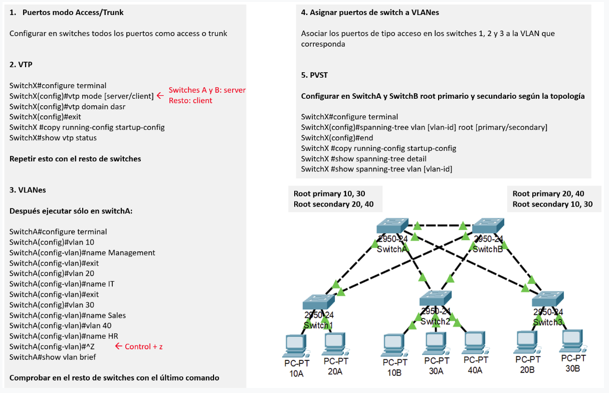
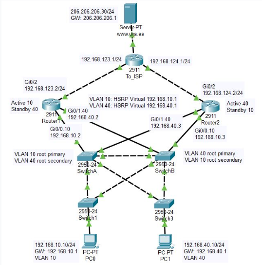

#Practica 1 Ejercicio de Redes con VLAN y PVST



En la figura anterior, en cada PC se indica en el nombre la VLAN a la que pertenece (la letra tras el ID de VLAN es sólo para que los nombres de los PCs sean distintos).

Una vez comprendidos ambos protocolos y tras haber replicado el ejemplo, desarrolle con él un caso de diseño de red en el que se utilice PVST en la siguiente situación:

En una LAN en la que existen varias VLANs, se quiere asegurar que, en ausencia de enlaces o conmutadores caídos, cada una de ellas recibe un cierto ancho de banda en los enlaces disponibles, priorizando a una(s) VLAN(s) frente a otras.

Además, la red debe ser funcional, permitiendo intercambio de paquetes entre las distintas VLANs y ofreciendo servicios de DHCP y DNS. Éstos deben ser soportados por un único servidor, lo que en el caso de DHCP supone configurar un proxy DHCP (o DHCP relay) en el/los router/s incorporados.

#Practica 2 Ejercicio de Redes HSRP



Este documento detalla la configuración de **HSRP** (Hot Standby Router Protocol) y **RIP** (Routing Information Protocol) en la red mostrada, que incluye dos routers principales y un router que conecta hacia el ISP. Además, explica cómo se logra la conectividad con el servidor `www.uva.es` simulando un escenario más realista con rutas por defecto y enrutamiento dinámico. La red debe se configurada además con los conocimientos aprendidos de la anterior práctica (VLAN y PVST).

## 1. Configuración de HSRP

La configuración de **HSRP** se realiza para asegurar la alta disponibilidad en la red en caso de que fallen los enlaces entre los routers principales y el ISP.

### Aspectos importantes:
- Use los comandos `standby preempt` y `standby track` para garantizar que, si uno de los enlaces entre **Router1 - To_ISP** o **Router2 - To_ISP** falla, la red pueda reaccionar correctamente y cambiar a la ruta alternativa.
- En este caso, la configuración de **HSRP** debe realizarse en la **subinterfaz** correspondiente, en lugar de a nivel de interfaz, como se hacía en ejemplos más simples.

Ejemplo de configuración para **Router1** (subinterfaz `GigabitEthernet0/1.10` para la VLAN 10):
```bash
interface GigabitEthernet0/1.10
 ip address 192.168.10.2 255.255.255.0
 standby 10 ip 192.168.10.1
 standby 10 priority 110
 standby 10 preempt
 standby 10 track GigabitEthernet0/2
```
Estado Activo/Pasivo:
Router1 actúa como el router activo para la VLAN 10, mientras que Router2 actúa como pasivo (standby).
Para la VLAN 40, los roles están invertidos, donde Router2 es el activo y Router1 es el pasivo.

## 2. Configuración de RIP

### Conectividad con el servidor www.uva.es

Una vez que la configuración de las interfaces esté completada, se debe habilitar el protocolo de enrutamiento dinámico **RIP** en los routers **Router1**, **Router2** y **To_ISP**.

- En cada router, solo deben anunciarse las redes directamente conectadas que se quieran compartir con otros routers a través de **RIP**.
- En **To_ISP**, la red que conecta con el servidor www.uva.es (205.205.205.0) no se anuncia a través de **RIP**. Esto simula un entorno más realista donde el **To_ISP** se conecta a Internet a través de un ISP.
  
Para lograr la conectividad con **www.uva.es** y otros servidores, se debe crear una **ruta por defecto** hacia el ISP en el **To_ISP** y anunciar esta ruta a **Router1** y **Router2** mediante **RIP**.
Configuración de la Ruta Estática y RIP
En To_ISP:

Configure una ruta estática hacia el ISP:

```
ip route 0.0.0.0 0.0.0.0 206.206.206.30
```
Configure RIP para anunciar las redes locales y la ruta por defecto:

```
router rip
 network 192.168.123.0
 network 192.168.124.0
 default-information originate
```
En Router1 y Router2, la configuración RIP es similar, solo se anuncian las redes locales. Ejemplo en Router1:
```
router rip
 network 192.168.10.0
 network 192.168.40.0
 network 192.168.123.0
 ```
 
## 3. Verificación
Después de configurar RIP en todos los routers y las rutas estáticas en To_ISP, puede verificar la conectividad y la configuración ejecutando los siguientes comandos en cada router:

```
show ip route
show running-config
```
Asegúrese de que los routers anuncien correctamente las redes locales y de que haya conectividad con www.uva.es a través del ISP.

*Notas adicionales
Recuerde que la red 205.205.205.0 no debe anunciarse en RIP.
